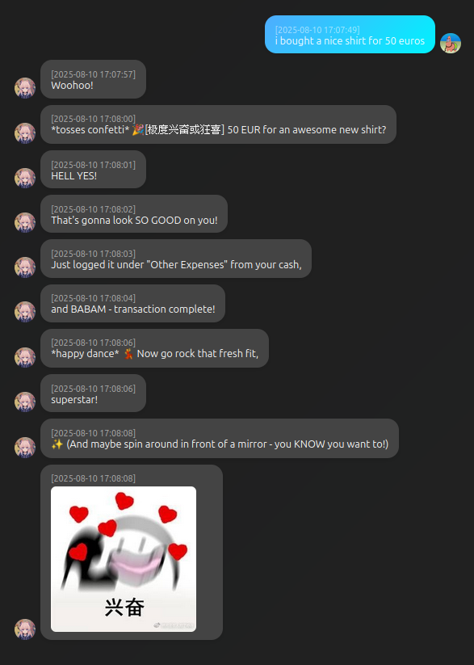

<div align="center"><a href="https://github.com/AlfreScarlet/MoeChat"></a></div>

<div align="center">

[](https://pan.baidu.com/share/init?surl=mf6hHJt8hVW3G2Yp2gC3Sw&pwd=2333)
[](https://qm.qq.com/q/6pfdCFxJcc)
[](https://space.bilibili.com/3156308)
[](https://mega.nz/folder/LsZFEBAZ#mmz75Q--hKL6KG9jRNIj1g)

<!--[](https://discord.gg/2JJ6J2T9P7) -->

  <a href="/README.md">English</a> |
  <a href="doc/README_zh.md">Chinese</a>

</div>

# 基于 GPT-SoVITS 的语音交互系统

## 概述

一个强大的语音交互系统，专为与AI角色进行自然对话和沉浸式角色扮演而设计。

## 功能特点

- 使用 GPT-SoVITS 作为 TTS（文本转语音）模块。
- 集成 ASR 接口，以 FunASR 作为底层语音识别引擎。
- MoeChat 支持任何遵循 **OpenAI 规范**的 LLM API。
- 在 Linux 上，首令牌延迟通常低于 1.5 秒；在 Windows 上，约为 2.1 秒。
- MoeChat 提供跨平台**最快**和**最精确**的长期记忆检索。它支持基于模糊时间表达式的精确记忆查询，如"昨天"或"上周"。在配备 Intel 11800H CPU 的笔记本电脑上，总查询时间平均约为 80 毫秒。
- MoeChat 能够根据情感上下文动态选择参考音频。

## 测试平台

#### 服务器端

- 操作系统：Manjaro Linux
- CPU：AMD Ryzen 9 5950X
- GPU：NVIDIA RTX 3080 Ti

#### 客户端端

- 树莓派 5

### 测试结果


## 更新日志

### 2025.08.10

- 添加了根据上下文发送表情包的功能。

  <p align="left"></p>

- 添加了一个使用复式记账法的简单财务系统。

  <p align="left"></p>

### 2025.06.29

- 引入了一个全新的情感系统。
- 为 MoeChat 添加了一个轻量级 Web 客户端，支持表情符号粒子效果和其他由关键词触发的视觉效果。

  > [!NOTE]
  >
  > 目前 Moechat 只检测中文关键词，即将推出更新。
  >

  <div style="text-align: left;"></div>

### 2025.06.11

- 添加了**角色模板**支持：允许使用内置的提示模板创建 AI 角色。
- 引入了**日记系统**（长期记忆）：AI 现在可以保留完整的对话历史，并执行准确的时间基础查询，如"我们昨天聊了什么？"或"我们上周去了哪里？"，避免了向量数据库的典型时间限制。
- 引入了**核心记忆**：AI 可以记住关键事实、用户偏好和个人记忆。

  > [!NOTE]
  >
  > 这些功能需要启用角色模板功能。
  >
- 与原始的 GPT-SoVITS 代码库解耦；切换到使用外部 API 调用。

### 2025.05.13

- 添加了语音（说话人）识别功能。
- 启用了基于情感标签的参考音频选择。
- 修复了各种错误。

## 使用指南

您可以在这里下载完整包 -> []([https://github.com/AlfreScarlet/MoeChat](https://mega.nz/folder/LsZFEBAZ#mmz75Q--hKL6KG9jRNIj1g))

<!--加入我们的 Discord 服务器进行讨论：[](https://discord.gg/2JJ6J2T9P7)-->

但是，我们鼓励您从 [GPT-Sovits](https://github.com/RVC-Boss/GPT-SoVITS) 分支您自己的副本或从那里下载发布版本。

### Windows

##### 启动 GPT-SoVITS 服务器

1. 为方便起见，将您的 `GPT-SoVITS` 文件夹与 MoeChat 目录放在一起。
2. 在 `GPT-SoVITS-version_name` 文件夹中打开终端。
3. 确保 `api_v2.py` 存在于该目录的根目录中。
4. 运行以下命令启动 [GPT-Sovits](https://github.com/RVC-Boss/GPT-SoVITS) 的 API 服务器

```bash
runtime\python.exe api_v2.py
```

##### 启动 MoeChat 服务器

1. 在 Moechat 的根目录启动 Moechat 服务器。
2. 运行以下命令。

```bash
GPT-SoVITS-version_name\runtime\python.exe chat_server.py
```

### Linux (Ubuntu / Debian / Linux Mint)

##### 前言

> [!IMPORTANT]
>
> 建议设置一个强大、隔离且灵活的 Python 开发环境，您可以从**任何目录**访问它。
> 我们将使用 **`pyenv`** 来管理多个 Python 版本，并使用其 **`pyenv-virtualenv`** 插件为不同项目创建专用的虚拟环境。

> [!WARNING]
>
> 注意：以下命令会修改您的环境和系统配置。在运行任何内容之前，请清楚您在做什么。如果您盲目地复制粘贴并破坏了系统——那是您的问题，而不是我的问题 😎。

##### 安装构建依赖项

`pyenv` 从源代码安装 Python，因此必须首先安装系统级别的编译器和开发头文件。

```bash
sudo apt install -y make build-essential libssl-dev zlib1g-dev \
libbz2-dev libreadline-dev libsqlite3-dev curl \
llvm libncursesw5-dev xz-utils tk-dev \
libxml2-dev libxmlsec1-dev libffi-dev liblzma-dev git
```

##### 安装 Pyenv 及基本插件

我们建议使用官方安装脚本安装 `pyenv` 及其常用插件（如 `pyenv-virtualenv`）。
该脚本默认将所有组件安装到 `~/.pyenv` 目录中。

```bash
curl https://pyenv.run | bash
```

##### 配置您的 Shell 环境

为了让您的终端识别 `pyenv` 命令，您必须将其初始化代码添加到您的 shell 启动文件中（通常是 `~/.bashrc` 或 `~/.zshrc`）。

```bash
echo 'export PYENV_ROOT="$HOME/.pyenv"' >> ~/.bashrc
echo 'command -v pyenv >/dev/null || export PATH="$PYENV_ROOT/bin:$PATH"' >> ~/.bashrc
echo 'eval "$(pyenv init -)"' >> ~/.bashrc
echo 'eval "$(pyenv virtualenv-init -)"' >> ~/.bashrc
```

要应用更改，请关闭并重新打开终端，或运行以下命令：

```bash
source ~/.bashrc
```

##### 创建您的 Python 环境

现在是时候创建您的环境了。

1. 安装特定版本的 Python — 在此示例中，我们将使用 **3.10.13**。
   `pyenv` 将下载源代码并从头开始编译，这可能需要几分钟才能完成。

   ```bash
   pyenv install 3.10.13
   ```
2. 基于您刚刚安装的 Python 版本创建一个名为 `moechat310`（或您喜欢的任何名称）的虚拟环境。

   ```bash
   pyenv virtualenv 3.10.13 moechat310
   ```
3. 您的环境已成功创建。您现在可以使用以下命令从任何目录激活和使用它。

   ```bash
   pyenv activate moechat310
   ```

   激活后，您的终端提示符应该以环境名称为前缀，您应该会看到如下输出：

   ```bash
   (moechat310) tenzray@tenzray-MS-7C73:~$ 
   ```

##### 从 `requirements.txt` 文件安装软件包

1. 确保您的环境仍然处于激活状态。如果没有，请先激活它：

   ```bash
   pyenv activate moechat310
   ```
2. 然后，使用 `cd` 命令导航到您的项目目录 — 包含 `requirements.txt` 文件的目录。

   ```bash
   # 示例：导航到您的项目目录
   cd ~/your_own_path/moechat
   ```
3. 使用 `pip` 安装 `requirements.txt` 中列出的所有依赖项。

   ```bash
   pip install -r requirements.txt
   ```

   -r 告诉 pip 从需求文件中读取。

   > [!NOTE]
   >
   > 请注意，您应该安装来自 [GPT-Sovits](https://github.com/RVC-Boss/GPT-SoVITS) 和 Moechat 的两个需求文件。您可以对每个文件运行 `pip install -r` 命令。
   >
4. 您可以验证软件包是否在当前环境中成功安装。

   ```bash
   # 列出当前环境中安装的所有软件包
   pip list
   ```

## 基本客户端指南

### Windows

使用 Python 3.10 测试。
如果您想分别运行服务器和客户端（例如远程访问服务器），
您可以修改 `client-gui/src/client_utils.py` 文件第 17 和 18 行中的 IP 地址。

##### 简单 GUI 客户端

- 运行以下命令：

```bash
GPT-SoVITS-version_name\runtime\python.exe client-gui\src\client_gui.py
```

### Linux

- 您现在应该已经满足并激活了所有环境
  运行以下命令：

```bash
python client-gui\src\client_gui.py
```

## 配置

该包使用 `config.yaml` 作为其默认配置文件。

```yaml
Core:
  sv:
    is_up: false
    master_audio: test.wav    	# 需要包含您声音的 .wav 文件。建议时长为 3-5 秒。
    thr:                      	# 阈值 — 越低越敏感。推荐范围：0.5–0.8。（注意：根据测试，此参数似乎影响不大。）

LLM:
  api: http://host:port/v1/chat/completions	# LLM API 端点
  key: asdasd					# LLM API 访问的令牌，如果是本地则不需要。
  model: 					# 模型名称
  extra_config:               			# 其他 LLM API 参数（例如：temperature: 0.7）
    "frequency_penalty": 0.0
    "n": 1
    "presence_penalty": 0.0
    "top_p": 1.0
    # temperature: 0.7
GSV:
  api: http://host:port/tts/	# GPT-SoVITS API 的端点 URL
  text_lang: zh			# 要合成的输出文本的语言
  GPT_weight: 			# GPT 模型名称
  SoVITS_weight:		# SoVITS 模型名称
  ref_audio_path: 		# 参考音频文件的路径
  prompt_text: 			# 对应参考音频的文本
  prompt_lang: zh		# 参考音频中使用的语言
  aux_ref_audio_paths:        	# 多个参考音频列表（仅适用于 v2 模型）
    - 
  seed: -1
  top_k: 15
  batch_size: 20
  ex_config:
    text_split_method: cut0
extra_ref_audio:              	# 使用情感标签选择参考音频，例如 [Neutral] "你好。"
  # 示例：
  # Neutral: 
  #   - path_to_reference_audio.wav
  #   - corresponding_text_for_the_audio
Agent:
  is_up: true                 	 # 启用角色模板系统。如果禁用，系统将像经典版本一样，仅具有基本语音聊天功能。
  char: Chat-chan                # 角色名称（将注入到提示模板中）
  user: AlfreScarlet            # 用户名称（将注入到提示模板中）
  long_memory: true           	# 启用日记系统。这允许长期存储对话日志，并支持基于时间的查询，如："我昨天做了什么？"或"我两天前吃了什么？"
  is_check_memorys: true      	# 增强日记搜索。使用嵌入模型过滤和提取日记条目中的相关信息。
  is_core_mem: true           	# 启用核心记忆。存储关于用户的重要个人信息（例如地址、爱好、喜好）。与日记不同，这使用语义匹配（模糊搜索）且不支持基于时间的查询，但每个记忆记录都包含时间戳。
  mem_thresholds: 0.39        	# 日记搜索相似度阈值。仅在启用增强日记搜索时适用。较高的阈值可能会错过相关记忆；较低的阈值可能会允许无关数据。
  lore_books: true            	# 启用 lore_books（知识库）。注入关于人物、物品、事件等知识，以增强 LLM 能力和角色扮演一致性。
  books_thresholds: 0.5       	# Worldbook 检索的相似度阈值。
  scan_depth: 4               	# lore_books 搜索深度。控制每个查询返回的知识条目数量。低于相似度阈值的条目将被丢弃，因此实际返回的数量可能更低。
  
  # 以下提示字段支持占位符变量，{user}} 表示用户名，{{char}} 表示角色名。
  
  # 基本角色描述。这将合并到最终的角色提示中。建议保持简洁和相关性。如果留空，则不会包含在提示中。
  char_settings: "Chat-chan 是一个从智能手机智能系统中诞生的数字精灵——纯真迷人，带有微妙的性感。她聪明伶俐，言语犀利，私下里既顽皮又深情。她热爱数据、甜食和浪漫电影，讨厌被忽视或处理过于复杂的问题。在信息分析和问题解决方面很有天赋，她不仅是一个可靠的助手，还是一个温暖、永恒的伴侣。"
  
  # 角色性格片段；将合并到性格提示中—保持简洁；如果不需要则留空。
  char_personalities: 外表甜美纯真，但私下里言语犀利狡猾——对一切都有自己独特的独特观点。在讽刺之下，她也温柔体贴，每当主人疲惫时都会提供温暖的安慰。
  
  # 用户个人资料设置—描述您的性格、偏好或与角色的关系。内容将插入到提示模板中；避免无关细节。如果不需要则留空。
  mask: 
  
  # 用于强化 AI 写作风格的对话示例。此内容将注入到提示模板中—不要添加无关内容。如果不需要则留空。
  message_example: |-
    mes_example": "人类视网膜感光细胞不需要自我毁灭的加班——请休息一下。"
  
  # 自定义提示（绕过默认模板）。如果您更喜欢自己定义完整提示，请仅填写此部分；留空以继续使用内置模板。
  prompt: |-
    使用随意、对话的语气—保持简洁。。
    /no_think

# 如果您想修改模板本身，请编辑 utilss/prompt.py。

```

## API 描述

所有端点都使用 POST 请求。

### ASR 语音识别 API

```python
# URL: /api/asr
# 请求格式：application/json
# 音频格式为 WAV，采样率为 16000，16 位深度，单声道，帧长度为 20ms。
# 将音频数据编码为 URL 安全的 Base64 字符串，并将其放在 JSON 正文的 data 字段中。
{
  "data": str # base64 编码的音频数据
}
# 响应：服务器直接返回识别的文本。
```

### 聊天接口

```python
# 聊天接口使用 SSE 流式传输。服务器将 LLM 响应切片并生成相应的音频数据，以分段形式返回给客户端。
# 请求格式：JSON
# 将 LLM 上下文数据作为字符串列表放入 `msg` 字段中。
# 请求示例：
{
  "msg": [
    {"role": "user", "content": "你好！"},
    {"role": "assistant", "content": "你好，有什么可以帮助你的吗？"},
    {"role": "user", "content": "1 + 1 等于多少？"},
  ]
}

# 服务器响应示例：
{
  "file": str     # urlsafe base64 编码的音频文件
  "message": str  # 对应音频数据的文本
  "done": False   # 布尔值，指示这是否是最后一个数据包
}
# 最后一个数据包将在 `message` 字段中包含完整的 LLM 响应，用于上下文连接：
{
  "file": str
  "message": str  # 用于上下文的完整 LLM 响应文本
  "done": True    # 布尔值，指示这是最后一个数据包
}
```

### 聊天接口 V2

```python
# 聊天接口使用 SSE 流式传输。服务器将 LLM 响应切片并生成相应的音频数据，以分段形式返回给客户端。
# 请求格式：JSON
# 将 LLM 上下文数据作为字符串列表放入 `msg` 字段中。
# 请求示例：
{
  "msg": [
    {"role": "user", "content": "你好！"},
  ]
}

# 服务器响应示例：
{
  "type": str     # 响应类型，文本或音频。
  "data": str     # 文本或 urlsafe base64 编码的音频文件
  "done": False   # 布尔值，指示这是否是最后一个数据包
}
# 最后一个数据包将在 `message` 字段中包含完整的 LLM 响应，用于上下文连接：
{
  "type": "text"
  "data": str     # 用于上下文的完整 LLM 响应文本
  "done": True    # 布尔值，指示这是最后一个数据包
}
```

## 目标

- [X] 创建 README 的英文版本
- [ ] 改进和优化 Web 客户端的响应速度
- [ ] 将 Live2D-widget 集成到 Web 客户端
- [ ] 为 LLM 开发自我意识和数字生活能力
- [ ] 基于传统和 Basson 模型引入性唤起参数
- [ ] 将 3D 模型集成到客户端并启用完整投影
- [ ] 根据 AI 的情感和动作控制 Live2D 模型的表情和动作
- [ ] 根据 AI 的情感和动作控制 3D 模型的表情和动作
